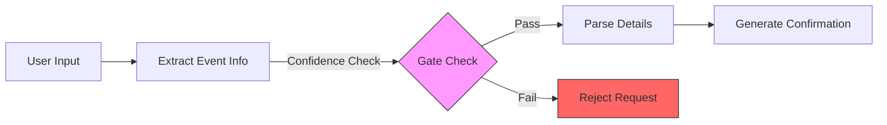
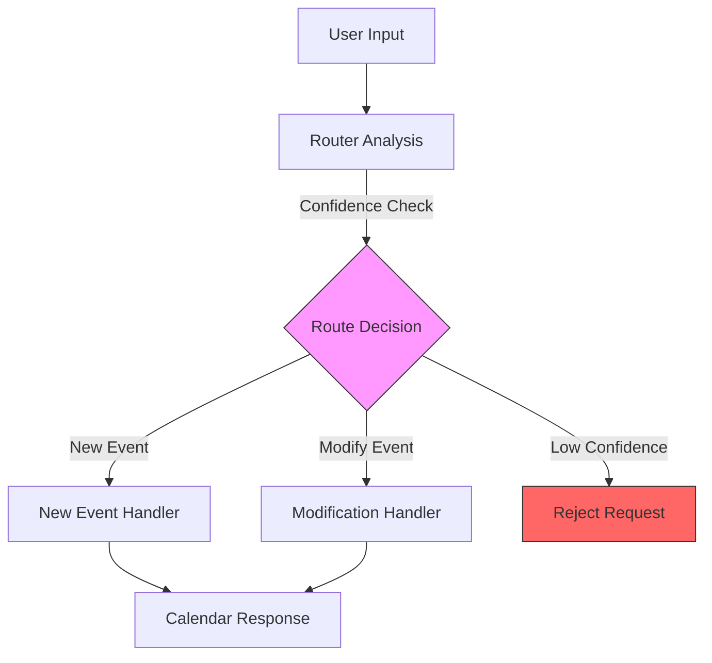
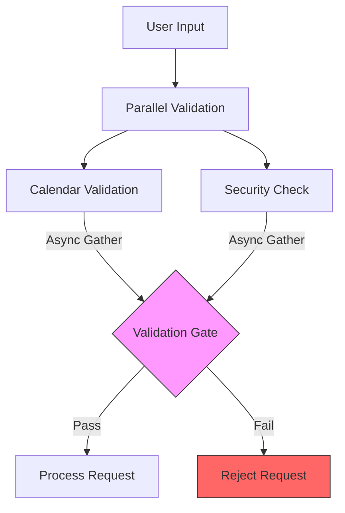
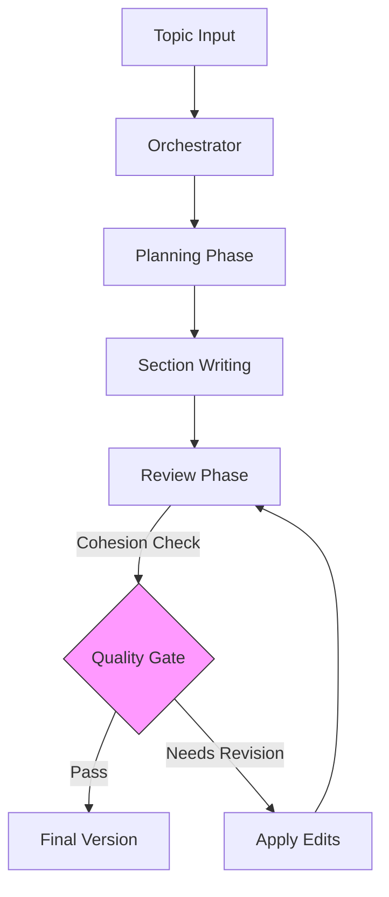

# Practical LLM Patterns in Python: A Developer's Guide

Ever wondered how to build reliable AI systems without drowning in frameworks? This guide shows you how to create powerful LLM workflows using pure Python. No fancy frameworks, just battle-tested patterns that actually work.

## Why This Guide?

If you've tried building LLM applications, you know the challenges:
- Keeping conversations on track
- Handling complex multi-step tasks
- Managing reliability and validation
- Ensuring type safety and validation
- Implementing proper logging and error handling

We'll tackle these head-on with patterns drawn from real production systems, using Pydantic for type safety and structured outputs. Think of this as your practical field guide to LLM development.

## What You'll Learn

### 1. Core Building Blocks
Start with the fundamentals:
- Making smart LLM calls with type safety
- Getting structured responses using Pydantic
- Working with tools and validation
- Implementing proper logging
- Managing async operations

### 2. Essential Workflow Patterns

#### The Chain Pattern (Prompt Chaining)
A sequential workflow that breaks down complex tasks into manageable, validated steps:



Real implementation: A calendar event processor that:
1. Extracts and validates event information
2. Applies confidence thresholds
3. Parses detailed event parameters
4. Generates structured confirmations

#### The Router Pattern
An intelligent dispatcher that routes requests to specialized handlers based on request type and confidence scoring:



Implementation features:
- Type-safe routing using Pydantic models
- Confidence threshold validation
- Specialized handlers for different request types
- Structured response generation

#### The Parallel Pattern
Concurrent validation and processing for improved performance and security:



Key features:
- Async validation using asyncio
- Parallel security and content checks
- Structured validation models
- Comprehensive logging

#### The Orchestra Pattern
A sophisticated content generation system that coordinates multiple LLM agents:



Implementation highlights:
- Structured content planning
- Coordinated multi-agent writing
- Quality metrics and revision cycles
- Type-safe content models

## Getting Started

1. Clone this repo
2. Install dependencies:
   ```bash
   uv venv
   source .venv/bin/activate
   uv pip install -r requirements.txt
   ```
3. Check out the examples in `workflows/`
4. Start with the basic patterns
5. Mix and match to build your solution

## Need Help?

- Check out the examples in `workflows/`
- Read the implementation guides
- Email me at fazil@centrai.co

Remember: The best pattern is the one that solves your specific problem. Start simple, test thoroughly, and iterate based on real usage.

