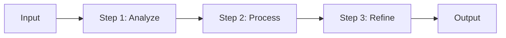
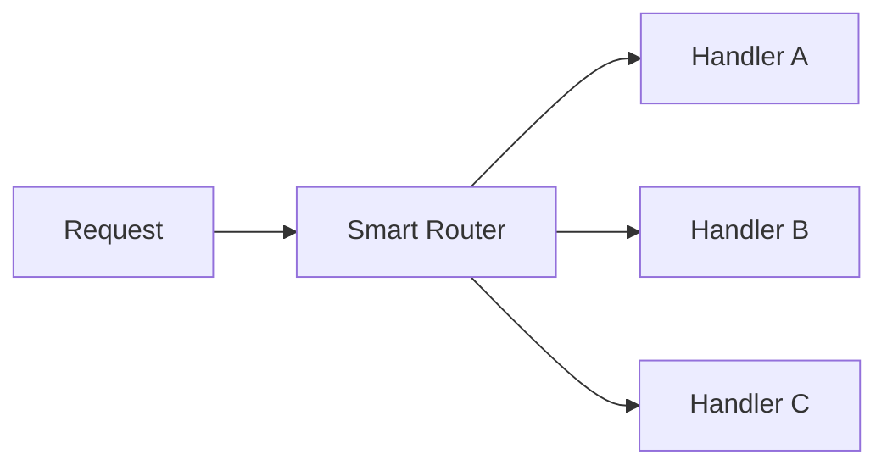
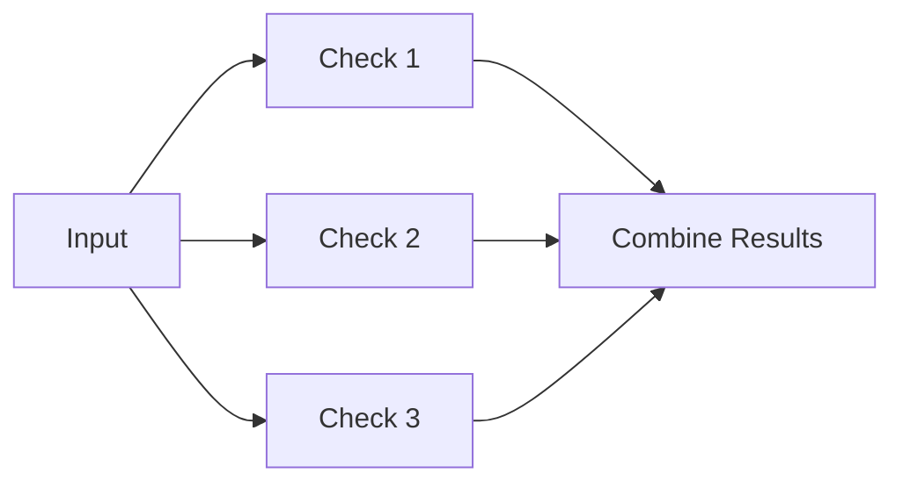
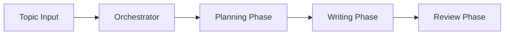

# Practical LLM Patterns in Python: A Developer's Guide

Ever wondered how to build reliable AI systems without drowning in frameworks? This guide shows you how to create powerful LLM workflows using pure Python. No fancy frameworks, just battle-tested patterns that actually work.

# Resources & References

- [Practical LLM Patterns](https://www.anthropic.com/news/practical-llm-patterns) - Anthropic Article
- [GenAI with PydanticAI + MongoDB Example](https://github.com/mongodb-developer/GenAI-Showcase/blob/main/notebooks/agents/ai_agent_with_pydanticai_and_mongodb.ipynb) - Implementation Guide
- [AI Cookbook Patterns](https://github.com/daveebbelaar/ai-cookbook/tree/main/patterns/workflows) - Workflow Inspiration
- [OpenAI Docs](https://platform.openai.com/docs/guides/function-calling) - OpenAI Docs

## Why This Guide?

If you've tried building LLM applications, you know the challenges:
- Keeping conversations on track
- Handling complex multi-step tasks
- Managing reliability and validation

We'll tackle these head-on with patterns drawn from real production systems. Think of this as your practical field guide to LLM development.

## What You'll Learn

### 1. Core Building Blocks
Start with the fundamentals:
- Making smart LLM calls
- Getting structured responses
- Working with tools
- Implementing retrieval

### 2. Essential Workflow Patterns

#### The Chain Pattern
Think of this as your assembly line for AI tasks. Instead of one massive prompt, you break things down into manageable steps:

Real-world example: A meeting scheduler that:
1. Checks if you're actually trying to schedule something
2. Pulls out the important details
3. Double-checks everything makes sense
4. Gives you a clean confirmation

#### The Router Pattern
Like a smart traffic controller for your AI system. It figures out what kind of request you're dealing with and sends it to the right handler:

Perfect for when you need to:
- Sort requests by type
- Use different models for different tasks
- Keep your code organized and maintainable

#### The Parallel Pattern
Why wait when you can multitask? Run multiple checks or processes at once:

Great for:
- Running multiple validations
- Generating different perspectives
- Improving response time

#### The Orchestra Pattern
Like a conductor leading a performance step by step, this pattern orchestrates complex tasks in a sequential flow:

Perfect for complex content creation tasks that require:
- Upfront planning and structure
- Sequential section-by-section writing
- Final review and cohesion check

## Getting Started

1. Clone this repo
2. Check out the examples folder
3. Start with the basic patterns
4. Mix and match to build your solution

## Need Help?

- Check out the examples folder
- Read the implementation guides
- Email me at fazil@centrai.co

Remember: The best pattern is the one that solves your specific problem. Start simple, test thoroughly, and iterate based on real usage.

